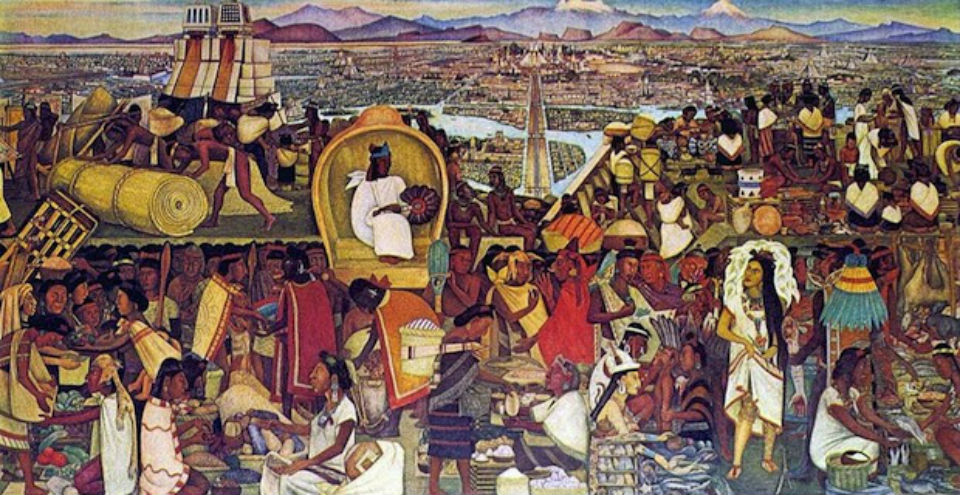

```{r paqueteria, include = FALSE}
  # Configuración general de los códigos
  knitr::opts_chunk$set(echo = TRUE, warning = FALSE, error = FALSE,
                        message = FALSE)
  formato <- list(digits = 2, big.mark = ",", decimal.mark = ".")
  
  # Paquetes necesarios
    paquetes <- c("tidyverse", "knitr", "bookdown", "latex2exp", "here")
    for (i in paquetes) {
      if (!require(i, character.only = TRUE)) {
        install.packages(i)
      }
      library(i, character.only = TRUE)
    }
    rm(list = c("i", "paquetes"))
    
  # Paquetes propios
    source(file.path("funciones", "graf1.R"))
```

# Prefacio {-}

(ref:tlat) Mercado de Tlatelolco (Diego Rivera, mural) en el Palacio Nacional.

```{r, fig.cap = '(ref:tlat)', echo = FALSE, fig.width = 4}
  
```

